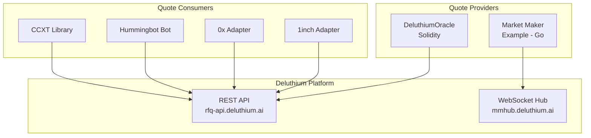

# Deluthium Ecosystem Hub

> One-stop portal for Market Makers integrating with Deluthium DEX

[](https://hub.docker.com/u/deluthium)
[](LICENSE)

## Overview

Deluthium (DarkPool) is a **Request-for-Quote (RFQ) based decentralized exchange** that sources liquidity from professional market makers. This hub provides all the tools, adapters, and resources you need to integrate with the Deluthium ecosystem.



## Quick Start

### One-Click Docker Setup

```bash
# Clone this repository
git clone https://github.com/thetafunction/deluthium-ecosystem-hub.git
cd deluthium-ecosystem-hub

# Set your JWT token
export DELUTHIUM_JWT="your-jwt-token-here"

# Start all services
docker-compose up -d

# Or start specific services
docker-compose up -d ccxt hummingbot
```

### Get a JWT Token

Contact the Deluthium team at [https://deluthium.ai](https://deluthium.ai) to apply for API access.

---

## Ecosystem Integrations

### Quote Consumers (For Traders & Aggregators)

| Integration | Description | Languages | Docker Image | Documentation |
|-------------|-------------|-----------|--------------|---------------|
| **CCXT** | Unified crypto exchange library | Python, TypeScript, PHP, Go, C# | `deluthium/ccxt:latest` | [CCXT Guide](docs/adapters/CCXT.md) |
| **Hummingbot** | Algorithmic trading bot | Python | `deluthium/hummingbot:latest` | [Hummingbot Guide](docs/adapters/HUMMINGBOT.md) |
| **0x Adapter** | 0x Protocol v4 RFQ adapter | TypeScript | `deluthium/0x-adapter:latest` | [0x Guide](docs/adapters/ZEROX.md) |
| **1inch Adapter** | 1inch Limit Order V4 adapter | TypeScript, Solidity | `deluthium/1inch-adapter:latest` | [1inch Guide](docs/adapters/ONEINCH.md) |

### Quote Providers (For Market Makers)

| Integration | Description | Language | Docker Image | Documentation |
|-------------|-------------|----------|--------------|---------------|
| **Hummingbot MM** | Market making bot with WebSocket connector | Python | `deluthium/hummingbot-mm:latest` | [Hummingbot MM Guide](docs/adapters/HUMMINGBOT.md#market-maker-mode) |
| **MM Example** | Reference implementation for MMs | Go | `deluthium/mm-example:latest` | [MM Guide](docs/MM_GUIDE.md) |
| **DeluthiumOracle** | Price oracle for 1inch aggregator | Solidity | N/A (Smart Contract) | [Oracle Guide](docs/adapters/ORACLE.md) |

---

## Supported Chains

| Chain | Chain ID | RFQ Manager | Router | Wrapped Native |
|-------|----------|-------------|--------|----------------|
| **BSC Mainnet** | 56 | `0x94020Af3571f253754e5566710A89666d90Df615` | `0xaAeD8af417B4bF80802fD1B0ccd44d8E15ba33Ff` | WBNB |
| **Base Mainnet** | 8453 | `0x7648CE928efa92372E2bb34086421a8a1702bD36` | `0xcd3cA39373A21EDF2d7E68C6596678525447Eb82` | WETH |
| **Ethereum Mainnet** | 1 | TBD | TBD | WETH |

---

## Market Maker Portal

Visit our [Market Maker Portal](https://portal.deluthium.ai) for:

- **Real-time API Monitoring**: Track latency (P50/P95/P99) and uptime across all endpoints
- **Incentive Dashboard**: View your rankings, trading volume, and pending rebates
- **Integration Toolkit**: One-click downloads and configuration generators

---

## Service Endpoints

| Service | URL | Purpose |
|---------|-----|---------|
| **REST API** | `https://rfq-api.deluthium.ai` | Quote consumer API |
| **WebSocket Hub** | `wss://mmhub.deluthium.ai/ws` | MM quote provider connection |
| **Portal** | `https://portal.deluthium.ai` | Market Maker dashboard |
| **Product** | `https://deluthium.ai/en/swap-plus` | End-user trading interface |

---

## Installation Options

### Option 1: Docker (Recommended)

```bash
# Pull individual images
docker pull deluthium/ccxt:latest
docker pull deluthium/hummingbot:latest
docker pull deluthium/0x-adapter:latest
docker pull deluthium/1inch-adapter:latest
docker pull deluthium/mm-example:latest
```

### Option 2: From Source

```bash
# CCXT
pip install ccxt  # Python
npm install ccxt  # JavaScript/TypeScript

# Hummingbot
git clone https://github.com/hummingbot/hummingbot.git
cd hummingbot && ./install

# 0x Adapter
git clone https://github.com/thetafunction/0x-deluthium-adapter.git
cd 0x-deluthium-adapter && npm install

# 1inch Adapter
git clone https://github.com/thetafunction/1inch-deluthium-adapter.git
cd 1inch-deluthium-adapter && npm install
```

### Option 3: One-Click Script

```bash
curl -sSL https://raw.githubusercontent.com/thetafunction/deluthium-ecosystem-hub/main/scripts/setup.sh | bash
```

---

## Usage Examples

### CCXT (Python)

```python
import ccxt

exchange = ccxt.deluthium({
    'apiKey': 'YOUR_JWT_TOKEN',
    'options': {
        'defaultChainId': 56,
        'defaultSlippage': 0.5,
    }
})

# Fetch markets
markets = exchange.fetch_markets()

# Get quote
quote = exchange.fetch_quote('WBNB/USDT', 1.0, 'buy')
print(f"Expected output: {quote['amount_out']}")

# Create order (returns calldata)
order = exchange.create_order('WBNB/USDT', 'market', 'buy', 1.0, None, {
    'walletAddress': '0xYourWallet'
})
```

### Hummingbot

```bash
# Start Hummingbot with Deluthium connector
docker run -it --name hummingbot \
  -v ./conf:/conf \
  -v ./logs:/logs \
  -e DELUTHIUM_JWT="your-token" \
  deluthium/hummingbot:latest
```

### 0x Adapter (TypeScript)

```typescript
import { ZeroExToDarkPoolProxy } from '@deluthium/0x-adapter';

const proxy = new ZeroExToDarkPoolProxy({
  jwtToken: process.env.DELUTHIUM_JWT,
  chainId: 56,
});

// Transform 0x order to DarkPool format
const darkPoolOrder = await proxy.transformAndSubmit(zeroExOrder);
```

### 1inch Adapter (TypeScript)

```typescript
import { DeluthiumAdapter } from '@deluthium/1inch-adapter';

const adapter = new DeluthiumAdapter({
  chainId: 56,
  signer: yourSigner,
});

// Convert Deluthium quote to 1inch LimitOrderV4
const limitOrder = await adapter.toLimitOrderV4(deluthiumQuote);
```

---

## Project Structure

```
deluthium-Ecosystem-Hub/
├── README.md                 # This file
├── docker-compose.yml        # One-click deployment
├── docker/                   # Dockerfiles for each adapter
│   ├── ccxt/
│   ├── hummingbot/
│   ├── 0x-adapter/
│   ├── 1inch-adapter/
│   └── mm-example/
├── portal/                   # Market Maker Portal (Next.js)
├── api-monitor/              # API monitoring service
├── docs/                     # Documentation
│   ├── QUICK_START.md
│   ├── MM_GUIDE.md
│   └── adapters/
└── scripts/                  # Utility scripts
```

---

## Documentation

- [Quick Start Guide](docs/QUICK_START.md)
- [Market Maker Integration Guide](docs/MM_GUIDE.md)
- [API Reference](docs/API_REFERENCE.md)

### Adapter-Specific Docs

- [CCXT Integration](docs/adapters/CCXT.md)
- [Hummingbot Connector](docs/adapters/HUMMINGBOT.md)
- [0x Protocol Adapter](docs/adapters/ZEROX.md)
- [1inch Limit Order Adapter](docs/adapters/ONEINCH.md)
- [Price Oracle](docs/adapters/ORACLE.md)

---

## Contributing

We welcome contributions! Please see our [Contributing Guide](CONTRIBUTING.md) for details.

1. Fork the repository
2. Create your feature branch (`git checkout -b feature/amazing-feature`)
3. Commit your changes (`git commit -m 'Add amazing feature'`)
4. Push to the branch (`git push origin feature/amazing-feature`)
5. Open a Pull Request

---

## Support

- **Website**: [https://deluthium.ai](https://deluthium.ai)
- **Documentation**: [https://docs.deluthium.ai](https://docs.deluthium.ai)
- **Portal**: [https://portal.deluthium.ai](https://portal.deluthium.ai)

For API access, integration support, or partnership inquiries, contact the Deluthium team directly.

---

## License

This project is licensed under the MIT License - see the [LICENSE](LICENSE) file for details.

---

*Built with love by the Deluthium team*
